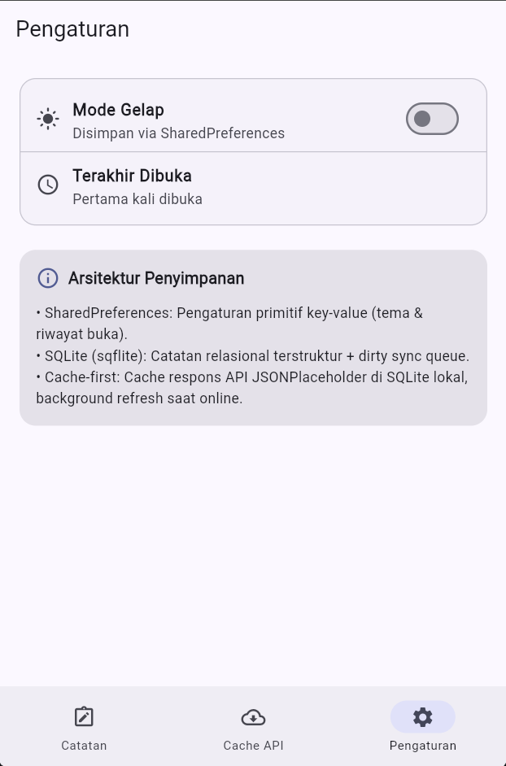
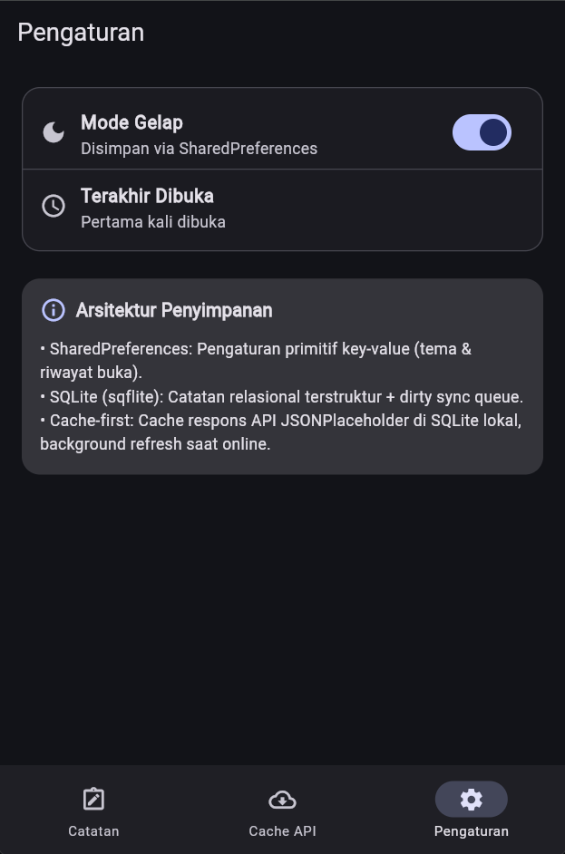
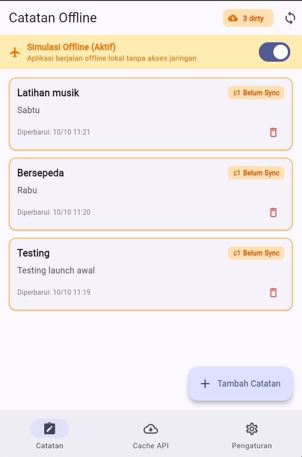
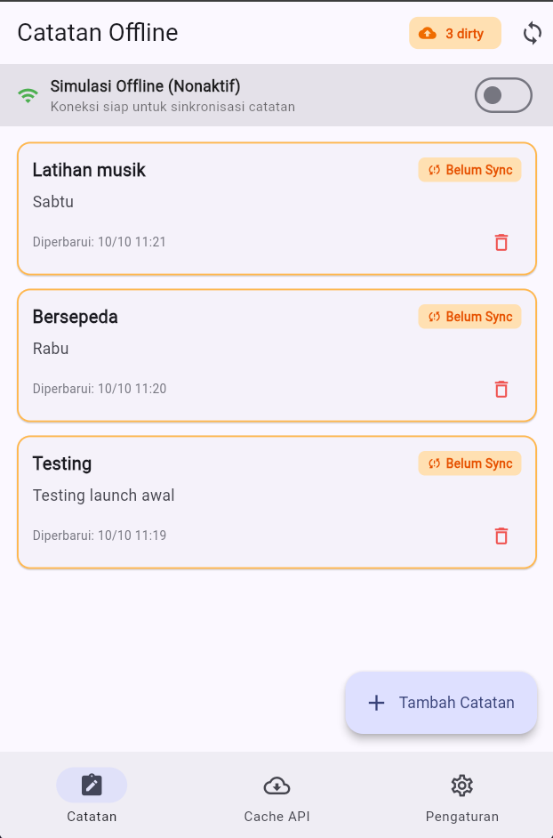
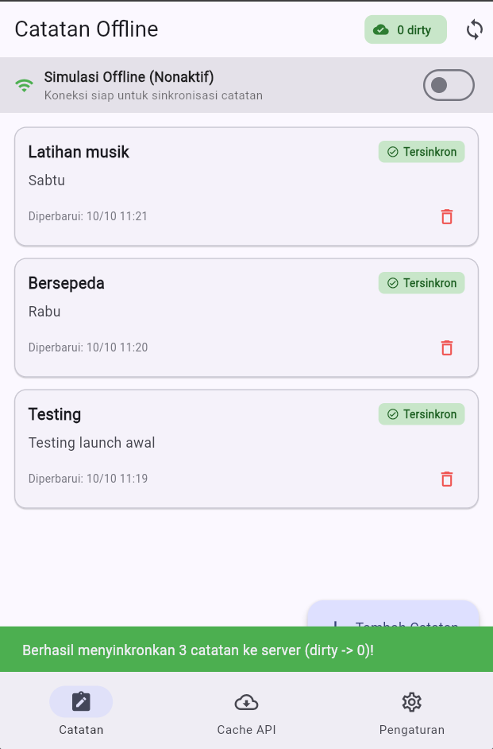
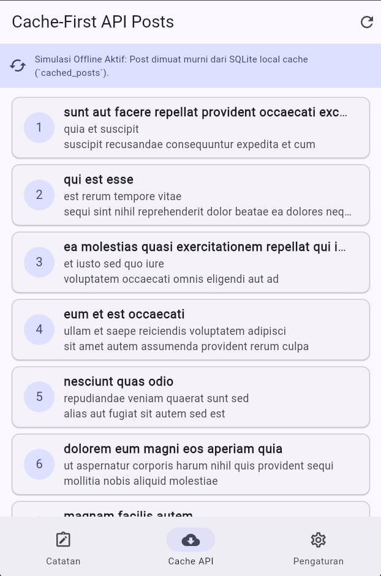

# Minggu 5: Local Storage & Offline-First

**Nama:** Aditya Rizqiqa Ramadhan  
**NIM:** 244107020008  
**Kelas:** TI-3E (Teknologi Informasi, Politeknik Negeri Malang)  

---

## 📌 Ringkasan Capaian Praktikum

Proyek ini telah menyelesaikan seluruh tahapan:
1. **Praktikum 1 (SharedPreferences):**
   - Pengaturan tema gelap/terang (`dark_mode`).
   - Riwayat pencatatan waktu aplikasi terakhir dibuka (`last_opened_at`).
   - Akses terpusat melalui [PrefsRepository](file:///d:/KULIAH%20TINGKAT%202/Semester%205/Repository/244107020008-mobile-course-1/05-week-5-local-storage-offline-first/week5_offline_notes/lib/data/prefs.dart) dan Riverpod `AsyncNotifierProvider`.
2. **Praktikum 2 (SQLite & Repository Catatan):**
   - Database SQLite mandiri melalui [db.dart](file:///d:/KULIAH%20TINGKAT%202/Semester%205/Repository/244107020008-mobile-course-1/05-week-5-local-storage-offline-first/week5_offline_notes/lib/data/local/db.dart) dengan tabel `notes` dan `cached_posts`.
   - Pola Repository lokal [NoteRepository](file:///d:/KULIAH%20TINGKAT%202/Semester%205/Repository/244107020008-mobile-course-1/05-week-5-local-storage-offline-first/week5_offline_notes/lib/data/repositories/note_repository.dart) dengan dependency injection `openDb` untuk kemudahan unit testing.
   - Operasi CRUD catatan lokal yang persist di perangkat.
3. **Praktikum 3 (Cache-First Read & Antrean Sync):**
   - **Cache-First API:** Membaca data dari tabel `cached_posts` seketika ke UI, lalu memperbarui data di background melalui HTTP fetch `/posts` (JSONPlaceholder).
   - **Dirty Sync Queue:** Catatan baru/diubah diberi flag `dirty = 1`. Badge dirty menampilkan jumlah catatan yang belum disinkronkan ke server.
   - **Sync Action:** Eksekusi `syncNotes(repo)` menandai seluruh data yang berhasil disinkronkan menjadi `dirty = 0`.
   - **Simulasi Offline Deterministik:** Disediakan toggle `forceOffline` pada provider untuk menguji fungsionalitas tanpa memutus koneksi internet sistem.
   - **Aturan Resolusi Konflik:** *Last-Write-Wins (LWW)* berdasarkan timestamp `updated_at`.
4. **AI Challenge & Verifikasi Teknis:**
   - Dokumentasi lengkap di [docs/ai_challenge.md](file:///d:/KULIAH%20TINGKAT%202/Semester%205/Repository/244107020008-mobile-course-1/05-week-5-local-storage-offline-first/docs/ai_challenge.md) dan [docs/storage_comparison.md](file:///d:/KULIAH%20TINGKAT%202/Semester%205/Repository/244107020008-mobile-course-1/05-week-5-local-storage-offline-first/docs/storage_comparison.md).
   - Membandingkan trade-off SharedPreferences, Hive, SQLite (sqflite), dan Drift.
   - Verifikasi kritis terhadap struktur data antrean sync, skalabilitas 1000+ catatan dengan index, dan justifikasi final pemilihan `SharedPreferences + SQLite`.
5. **Refactoring & Testing:**
   - Ekstraksi widget mandiri [NoteTile](file:///d:/KULIAH%20TINGKAT%202/Semester%205/Repository/244107020008-mobile-course-1/05-week-5-local-storage-offline-first/week5_offline_notes/lib/pages/notes_page.dart).
   - Pemisahan servis sinkronisasi ke [sync.dart](file:///d:/KULIAH%20TINGKAT%202/Semester%205/Repository/244107020008-mobile-course-1/05-week-5-local-storage-offline-first/week5_offline_notes/lib/data/sync.dart).
   - Unit test lengkap pada [note_test.dart](file:///d:/KULIAH%20TINGKAT%202/Semester%205/Repository/244107020008-mobile-course-1/05-week-5-local-storage-offline-first/week5_offline_notes/test/note_test.dart) (null safety mapping, retensi flag dirty, provider override sukses, dan provider override simulasi error). Seluruh test lulus 100% (5/5).

---

## 🤖 Ringkasan AI Verification Checklist

| Pertanyaan Verifikasi | Hasil Evaluasi | Catatan Kritis |
|---|---|---|
| Menolak catatan di SharedPreferences? | **Ya (Ditolak)** | SharedPreferences hanya untuk preferensi primitif; koleksi catatan di JSON string rawan korupsi & tidak efisien. |
| Skema mendukung antrean sync? | **Ya (Valid)** | Terdapat field `dirty INTEGER` dan `updated_at TEXT` untuk antrean sinkronisasi & deteksi konflik. |
| Klaim real-time didukung stream? | **Ya (Diverifikasi)** | Pada SQLite sqflite, sinkronisasi UI ditangani oleh Riverpod provider invalidation. |
| Estimasi boilerplate masuk akal? | **Ya (Diverifikasi)** | `sqflite` + `shared_preferences` dipilih karena stabil, ringan, dan tidak memerlukan `build_runner`. |
| Keputusan final & justifikasi? | **Ditetapkan** | Kombinasi SharedPreferences (tema/waktu) + SQLite (catatan/cache-first) adalah opsi optimal industri. |

Dokumentasi lengkap AI Challenge dapat dibaca di [docs/ai_challenge.md](file:///d:/KULIAH%20TINGKAT%202/Semester%205/Repository/244107020008-mobile-course-1/05-week-5-local-storage-offline-first/docs/ai_challenge.md).

---

## 📂 Struktur Proyek

```
05-week-5-local-storage-offline-first/
├── docs/
│   ├── ai_challenge.md         # Laporan AI Prompt Challenge & Verification Checklist
│   └── storage_comparison.md   # Perbandingan SharedPreferences, Hive, SQLite, Drift
├── screenshots/                # Folder tangkapan layar pengujian offline & sync
│   ├── 01-offline-notes.png
│   ├── 02-dirty-badge-before-sync.png
│   ├── 03-dirty-badge-after-sync.png
│   ├── 04-offline-cache.png
│   ├── 05-settings.png
│   └── 06-dark-mode-theme.png
├── week5_offline_notes/
│   ├── lib/
│   │   ├── data/
│   │   │   ├── local/
│   │   │   │   ├── db.dart
│   │   │   │   └── note.dart
│   │   │   ├── prefs.dart
│   │   │   ├── sync.dart
│   │   │   └── repositories/
│   │   │       └── note_repository.dart
│   │   ├── pages/
│   │   │   ├── notes_page.dart
│   │   │   ├── posts_page.dart
│   │   │   └── settings_page.dart
│   │   └── main.dart
│   ├── test/
│   │   ├── note_test.dart
│   │   └── widget_test.dart
│   └── pubspec.yaml
└── README.md
```

---

## 🚀 Cara Menjalankan

Masuk ke direktori aplikasi:
```bash
cd week5_offline_notes
```

Jalankan pengujian unit & widget test:
```bash
flutter test
```

Verifikasi analisis lint & error:
```bash
flutter analyze
```

Jalankan aplikasi di emulator atau perangkat fisik:
```bash
flutter run
```

---

## 📷 Lampiran Dokumentasi & Screenshots

Berikut adalah dokumentasi tangkapan layar hasil implementasi dan pengujian aplikasi pada folder [screenshots/](file:///d:/KULIAH%20TINGKAT%202/Semester%205/Repository/244107020008-mobile-course-1/05-week-5-local-storage-offline-first/screenshots/):

| Skenario | Screenshot | Deskripsi Fitur |
|---|---|---|
| **Praktikum 1: SharedPreferences (Pengaturan & Waktu Buka)** |  | Pengaturan tema dan pencatatan riwayat waktu terakhir dibuka via `SharedPreferences`. |
| **Praktikum 1: Tema Mode Gelap (Dark Mode)** |  | Penerapan tema gelap dinamis dan persisten menggunakan Riverpod `AsyncNotifierProvider`. |
| **Praktikum 2: SQLite CRUD Catatan Lokal** |  | Daftar catatan lokal persisten di SQLite (`sqflite`) yang diurutkan berdasarkan `updated_at DESC`. |
| **Praktikum 3: Antrean Sync Sebelum Sinkronisasi (Dirty Flag)** |  | Catatan baru diberi tanda `dirty = 1` dengan indikator badge peringatan oranye (`1 dirty`). |
| **Praktikum 3: Hasil Sinkronisasi Catatan (Dirty Kembali ke 0)** |  | Aksi sinkronisasi berhasil mengeksekusi `syncNotes()`, status berubah menjadi tersinkron (`0 dirty`). |
| **Praktikum 3: Cache-First Read API Posts** |  | Data posts dimuat seketika dari tabel cache SQLite lokal `cached_posts` saat kondisi offline. |

---

## ✅ Checklist Verifikasi Mandiri Codelab (Industry Challenge)

- [x] **Preferensi Pengaturan:** Toggle tema gelap/terang serta waktu terakhir dibuka tersimpan persisten melalui SharedPreferences.
- [x] **CRUD Catatan SQLite:** Berjalan persisten via `sqflite` melalui repositori lokal terisolasi; query daftar terurut `updated_at DESC`.
- [x] **Pola Offline-First:** Penerapan *Cache-First* untuk respons API, *Dirty Flag* untuk antrean sinkronisasi, dan aturan resolusi konflik *Last-Write-Wins (LWW)*.
- [x] **Uji Mode Offline:** Tersedia tombol simulasi `forceOffline` deterministik untuk demo tanpa internet; catatan tetap dapat dibaca/ditulis dan badge dirty bertambah akurat.
- [x] **Automated Testing:** Minimal 2 test yang lulus (model unit test & provider test dengan `FakeNoteRepository`). Aplikasi ini menyertakan **5/5 test lulus 100%**.
- [x] **Dokumentasi AI Challenge:** Prompt asli, tabel perbandingan komparatif 4 engine, skema 1000+ catatan, dan checklist verifikasi terdokumentasi rapi di folder `docs/`.
- [x] **Struktur Standar Repositori:** Struktur folder memenuhi standar: `lib/`, `test/`, `docs/`, `screenshots/`, dan `README.md`.

---

## 💡 Refleksi

### 1. Mengapa daftar catatan tidak boleh disimpan di SharedPreferences? Apa yang rusak jika aturan ini dilanggar?
* **Bottleneck Serialisasi I/O Penuh:** SharedPreferences didesain untuk menyimpan nilai primitif tunggal (boolean, integer, string) ke dalam file XML (Android) atau Plist (iOS). Jika seluruh daftar catatan disimpan sebagai satu string array JSON raksasa, setiap operasi penambahan, pengubahan, atau penghapusan 1 baris catatan akan memaksa sistem membaca, men-deserialize, memodifikasi, men-serialize ulang, dan menuliskan kembali seluruh file ke storage fisik disk.
* **Kehilangan Fitur Relasional & Indexing:** SharedPreferences tidak memiliki mesin kueri SQL. Fitur esensial seperti `ORDER BY updated_at DESC`, paginasi `LIMIT`/`OFFSET`, maupun filter antrean `WHERE dirty = 1` tidak dapat dilakukan di level database, melainkan harus diproses manual di CPU dan memori RAM aplikasi.
* **Kerapuhan Transaksi & Risiko Korupsi Data:** SharedPreferences tidak menjamin sifat ACID (*Atomicity, Consistency, Isolation, Durability*). Jika aplikasi mengalami *crash* atau *force close* saat sedang menulis ulang string JSON yang besar, file berisiko rusak (*corrupted*) dan mengakibatkan seluruh data catatan hilang seketika.

### 2. Kapan cache-first cukup, dan kapan Anda membutuhkan strategi lain (misalnya network-first untuk data harga real-time)?
* **Cache-First Cukup Digunakan:**
  * Pada data yang bersifat *semi-statis* atau tingkat perubahannya rendah (misalnya: artikel berita, katalog produk referensi, profil pengguna, dan daftar postingan blog).
  * Saat prioritas utama aplikasi adalah **kecepatan muat awal (*Time to Interactive*)** dan kenyamanan visual pengguna agar terhindar dari layar kosong (*blank screen*) saat jaringan lambat atau putus.
* **Network-First Wajib Digunakan:**
  * Pada data yang memiliki volatilitas tinggi dan dampak finansial/keamanan kritis, seperti grafik harga saham, nilai tukar mata uang valas (*real-time forex*), sisa kuota tiket konser, atau saldo rekening perbankan.
  * Pada kasus tersebut, menyajikan data usang (*stale data*) bahkan untuk hitungan detik dapat menyebabkan keputusan transaksi yang keliru bagi pengguna. Cache lokal pada strategi *network-first* hanya difungsikan sebagai cadangan darurat (*fallback*) saat koneksi internet benar-benar terputus.

### 3. Bagaimana dirty flag berubah menjadi antrean sync tanpa memblokir UI? Kapan antrean terpisah (tabel outbox) menjadi perlu?
* **Mekanisme Dirty Flag Non-Blocking:**
  * Di level data lokal, setiap mutasi langsung mengubah data di SQLite dan menandai `dirty = 1` secara instan (hanya butuh beberapa milidetik). UI langsung merefleksikan perubahan dari data lokal.
  * Sinkronisasi ke server dijalankan secara asinkron (*background task*) melalui `Future` atau *worker thread*. Saat proses HTTP request berlangsung, pengguna tetap leluasa membaca dan membuat catatan baru tanpa terganggu (*non-blocking UI*).
  * Setelah server mengonfirmasi status sukses (200 OK), repositori memperbarui flag menjadi `dirty = 0`.
* **Kebutuhan Tabel Antrean Terpisah (Tabel Outbox):**
  * Flag sederhana (`dirty = 1` pada tabel utama) cukup untuk operasi dasar *upsert*. Namun, tabel terpisah (*outbox table*) menjadi **mutlak diperlukan** ketika:
    1. **Mencatat Operasi Penghapusan (*Soft-Delete vs Hard-Delete*):** Catatan yang dihapus lokal tidak boleh langsung di-`DELETE` dari SQLite sebelum server mengetahui bahwa catatan tersebut telah dihapus. Tabel outbox dapat menyimpan aksi `{entity_id, action: 'DELETE', timestamp}`.
    2. **Menjaga Urutan Mutasi (*Chronological Execution*):** Jika sebuah catatan diedit berkali-kali secara offline, tabel outbox mencatat riwayat operasi berurutan agar server dapat memutar ulang (*replay*) mutasi sesuai urutan aslinya.
    3. **Penanganan Retry & Backoff:** Tabel outbox dapat menyimpan metadata tambahan seperti `retry_count`, `last_error_message`, dan `next_retry_at` untuk menangani kegagalan jaringan secara bertahap (*exponential backoff*).

### 4. Bagian mana dari rekomendasi AI yang Anda tolak, dan mengapa?
* **Menolak Penggunaan Library Berat yang Memerlukan Code Generation Berlebih (Drift):**  
  Meskipun AI menyoroti keunggulan *type-safety* dan reaktivitas *stream* bawaan pada Drift, saya memutuskan **menolak Drift untuk ruang lingkup proyek ini** dan tetap memilih kombinasi standar **`sqflite` + Riverpod**.  
  *Alasan Teknis:* Drift membutuhkan dependensi ganda (`drift`, `drift_dev`, `build_runner`) yang memperlambat durasi build proyek secara signifikan dan rawan konflik *dependency constraints* saat dikompilasi di berbagai versi Flutter SDK. Dengan memanfaatkan `sqflite` bersama model Dart null-safe defensif serta invalidasi provider Riverpod, kita memperoleh efisiensi dan stabilitas yang setara tanpa beban *code generation*.
* **Menolak Struktur Penyimpanan Koleksi Catatan di SharedPreferences:**  
  Setiap saran yang mengusulkan penyimpanan list catatan ke `SharedPreferences` ditolak secara tegas karena tidak memenuhi standar integritas data dan arsitektur *offline-first*.

---

## 📚 Referensi Pendukung

- [Slide Week 5: Local Storage & Offline First](https://jti-polinema.github.io/flutter-codelab/00-slides/Week_05_Local_Storage_Offline_First.html)
- [Flutter Cookbook: Store key-value data on disk](https://docs.flutter.dev/cookbook/persistence/key-value)
- [shared_preferences Package - pub.dev](https://pub.dev/packages/shared_preferences)
- [sqflite Package - pub.dev](https://pub.dev/packages/sqflite)
- [Hive Package (Alternatif NoSQL)](https://pub.dev/packages/hive)
- [Drift Package (Alternatif Reaktif & Type-Safe)](https://pub.dev/packages/drift)
- [Riverpod Documentation: AsyncNotifier dan AsyncValue](https://riverpod.dev/docs/concepts/async_notifiers)
- [Learn Dart in Y Minutes](https://learnxinyminutes.com/dart/)